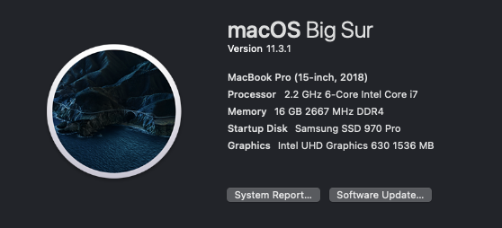

# Razer Blade 15 2018 Base Model Hackintosh

OpenCore is the standard now and what most people recommend and use. [This](https://dortania.github.io/OpenCore-Install-Guide/) is the starting point. There's a great [Discord server](https://discord.gg/8aKs69x) where you can ask for help if you get stuck or if you have any questions.

## Hardware

I've made two changes to the laptop's hardware in order to be compatible with macOS:

- stock SSD => Samsung SSD 970 PRO 1TB
- stock network card => Broadcom BCM94360NG

If you want to use a version of macOS more recent than High Sierra, you should know that there are no Nvidia drivers available for GTX 1060 Max-Q and it should be disabled as to not waste power.

## ACPI

You can get pretty far using prebuilt SSDTs. [These](https://dortania.github.io/Getting-Started-With-ACPI/ssdt-methods/ssdt-prebuilt.html#laptop-coffee-lake-8th-gen) are the ones Dortania recommends for Coffee Lake laptops:

- SSDT-PLUG-DRTNIA
- SSDT-EC-USBX-LAPTOP
- SSDT-AWAC
- SSDT-PNLF-CFL
- SSDT-XOSI

You don't need SSDT-AWAC for this laptop, it doesn't have an AWAC clock and RTC is enabled. I've initially included and used the rest. Afterwards I've compiled SSDTs manually (these are in the repo).

### SSDT-PNLF-CFL

If you look up the BIOS device name, it'll be `\_SB.PCI0.GFX0` which is used in sample SSDT - let's just grab that.

### SSDT-EC-USBX-LAPTOP

The embedded controller name is `EC0` and the pathing is `PCI0.LPCB`. Our PNP0C09 already has an `_STA` method so we'll need to create a "dummy" EC for macOS.

### SSDT-PLUG-DRTNIA

The first processor in the list is `SB.PR00`.

### SSDT-PMC

The LowPinCount path is `LPCB` and the PCI path is `PCI0`.

### SSDT-SBUS-MCHC

The ACPI pathing is `PCI0.SBUS` as is in their sample so it doesn't have to be modified in any way (this is at time of writing, you have to double check).

## Installing macOS

If your keyboard and mouse don't work make sure to set xhciportlimit to false.

Other than this, there are two issues you'll probably run into: ["Kernel Panic on Invalid frame pointer"](https://dortania.github.io/OpenCore-Install-Guide/troubleshooting/extended/kernel-issues.html#kernel-panic-on-invalid-frame-pointer) and ["Stuck at 2 minutes remaining"](https://dortania.github.io/OpenCore-Install-Guide/troubleshooting/extended/userspace-issues.html#stuck-at-2-minutes-remaining). For the first one you'll want to set the following in config.plist:

- DevirtualiseMmio -> False
- SetupVirtualMap -> True
- EnableWriteUnprotector -> True
- RebuildAppleMemoryMap -> False
- SyncRuntimePermissions -> False

The second issue is resolved by including [SSDT-PMC](https://dortania.github.io/Getting-Started-With-ACPI/Universal/nvram.html).

## Post Install

These things won't be working at this point:

- Audio
- Sleep
- Battery status
- Trackpad

### Disabling dGPU

I've used the [Optimus Method](https://dortania.github.io/Getting-Started-With-ACPI/Laptops/laptop-disable.html#optimus-method) for this. The API path for Nvidia GTX 1060 Max-Q is `\_SB.PCI0.PEG0.PEGP`. You'll need to compile the provided `SSDT-dGPU-Off.dsl` (or take my file).

### Fixing Audio

The codec is ALC256. Using layout ID 23 fixes audio and makes enables both speakers and headphones jack.

### Fixing Sleep

Follow [preparations](https://dortania.github.io/OpenCore-Post-Install/universal/sleep.html#preparations) and apply the [GPRW Instant Wake Patch](https://dortania.github.io/OpenCore-Post-Install/usb/misc/instant-wake.html#gprw-uprw-lanc-instant-wake-patch).

### Fixing Battery Status

The fastest way to get this working now is to use [ECEnabler](https://github.com/1Revenger1/ECEnabler) (with Lilu, VirtualSMC and SMCBattery).

### Fixing Trackpad

Beats me, I spent quite a while on this and decided to use an external trackpad lol. If you find a way to get it working I'd like to know. :)
